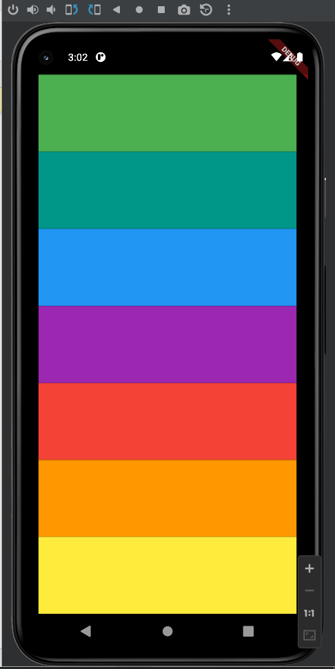

# Xylophone

It is my 5th flutter app while learning the flutter. It was
app which run 7 different tones as xylophone.

## Functionality:

It is consisting of seven different colors. Each color rings different
tone.

## Learning 

I have learned and Used in this Project

1.  Widget function

2.  Adding packages

3.  Audio player

> Error is faced that some Audio_Cacha.dart is no longer supported. I
> have updated the Code to latest Audio player

## Output

